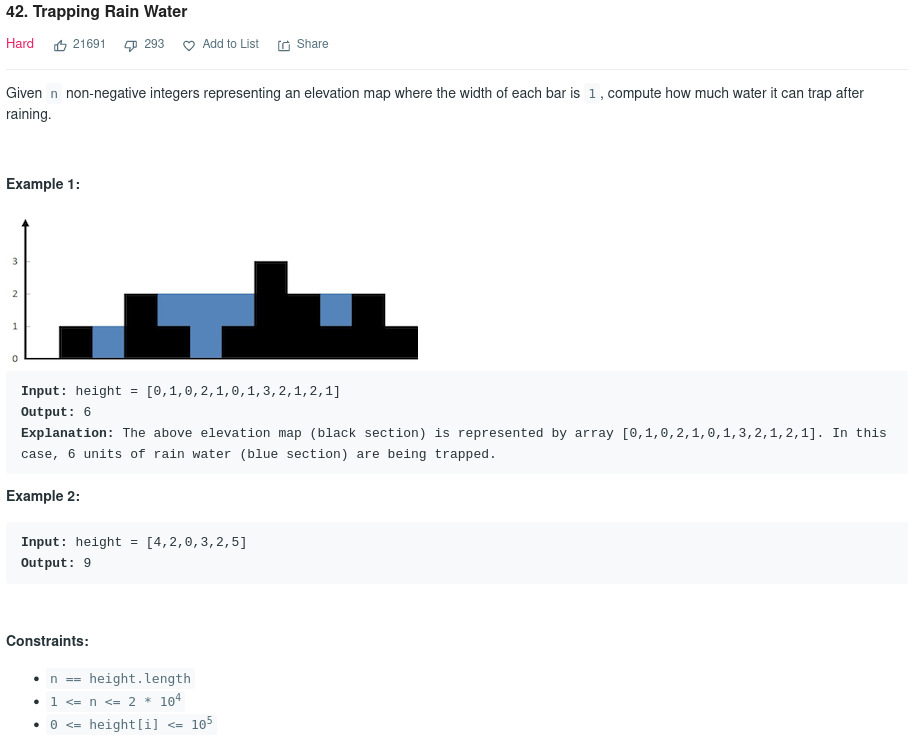
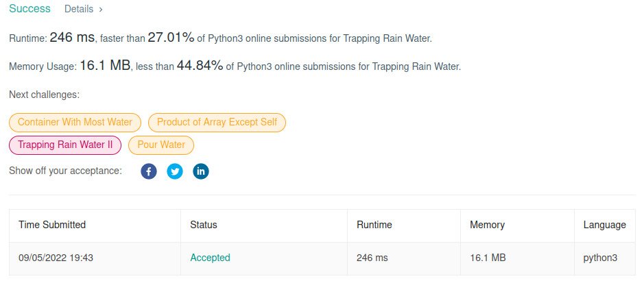
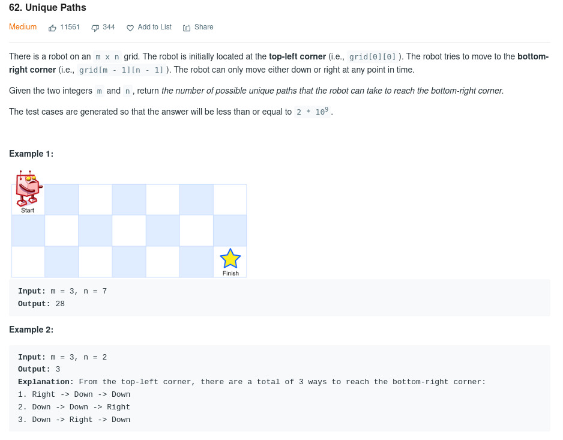
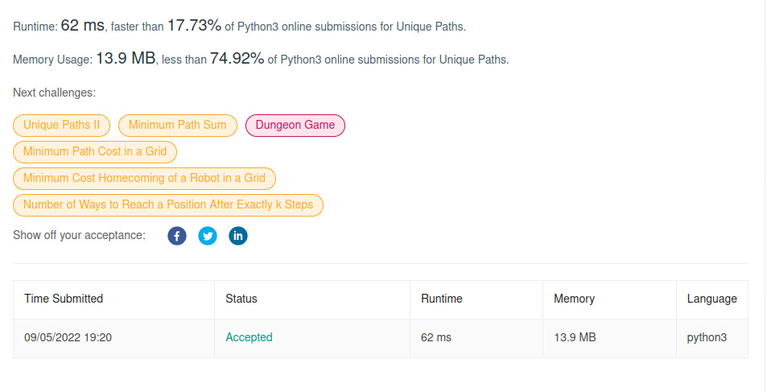
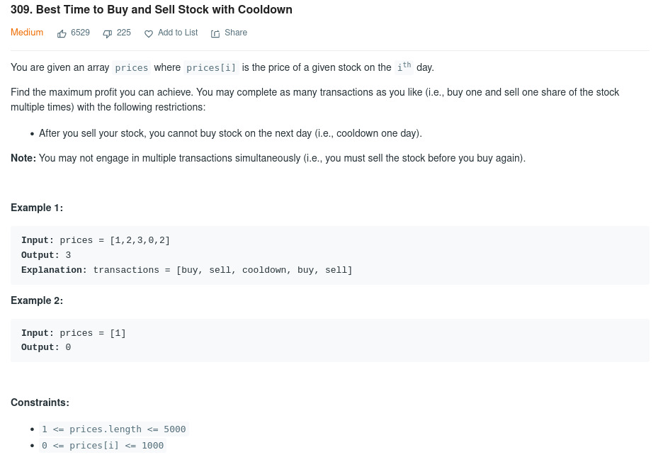

# Resolução de Execícios - Programação Dinâmica

**Número da Lista**: - 
**Conteúdo da Disciplina**: Programação Dinâmica 

## Alunos
|Matrícula | Aluno |
| -- | -- |
| 18/0124099  |  Juliana Pereira Valle Gonçalves |
| 18/0106805  |  Mateus Cunha Maia |

## Sobre 
Este repositório tem a solução para 3 exercícios do site https://leetcode.com/, sendo dois médios e um difícil, essa é uma classificação do próprio site.

## Screenshots

### Trapping Rain Water - 42

### Unique Paths - 62

### Best Time to Buy and Sell Stock with Cooldown - 309

## Instalação 
**Linguagem**: python  

## Uso 
Para testar os projetos é necessário acessar a página do problema, colocar o código no campo do código e escolher a opção de submit.

